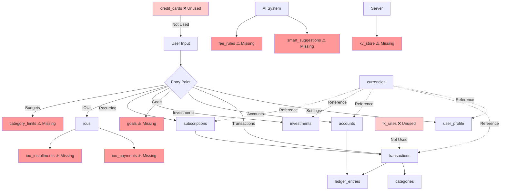

# Financial Hub v3.2 - Data Save Path Analysis

**Generated:** 2026-01-23  
**Updated:** 2026-01-23  
**Purpose:** Map application data flows to database tables and identify optimization opportunities

---

## 🎯 Status Update

> [!NOTE]
> **Action Completed (2026-01-23):** Option 1 - Updated `database-structure.md` with missing tables
> 
> ✅ **Added 8 tables to database-structure.md:**
> - `ious` - Personal debt tracking
> - `iou_payments` - IOU payment history
> - `iou_installments` - IOU installment plans
> - `categories` - Transaction categories
> - `category_limits` - Budget limits
> - `smart_suggestions` - AI insights
> - `fee_rules` - Fee detection
> - `kv_store` - Key-value storage
>
> 🔴 **CRITICAL FINDING:** The `goals` table does NOT exist in the database!
> - Application code references `goals` table in `api.ts`
> - Database queries confirm table is missing
> - **Impact:** Goals feature is completely broken
> - **Action Required:** Create `goals` table OR remove goals feature from application

---

## Table of Contents

1. [Application Entry Points](#application-entry-points)
2. [Data Flow Mapping](#data-flow-mapping)
3. [Table Usage Analysis](#table-usage-analysis)
4. [Findings & Recommendations](#findings--recommendations)

---

## Application Entry Points

### Primary Data Entry Screens

| Screen/Feature | User Actions | Data Created |
|---------------|--------------|--------------|
| **Dashboard** | View balances, insights | Read-only |
| **Transactions** | Add/Edit/Delete expenses & income | `transactions`, `categories`, `ledger_entries` |
| **Accounts** | Create/Edit accounts, transfers | `accounts`, `ledger_entries`, `transactions` |
| **Goals** | Create/Edit/Delete goals | `goals` |
| **Investments** | Track investments | `investments` |
| **Recurring** | Manage subscriptions & recurring transactions | `subscriptions`, `transactions` |
| **IOUs** | Track debts (lent/borrowed) | `ious`, `iou_payments`, `iou_installments` |
| **Budgets** | Set category limits | `category_limits` |
| **Settings** | User preferences | `user_profile` |

---

## Data Flow Mapping

### 1. User Profile & Settings

**Entry Point:** Settings screen  
**API Method:** `api.updateSettings()`, `api.getSettings()`

```
User Input → user_profile table
├─ base_currency_code
├─ display_mode (HISTORICAL/TODAY)
├─ theme
├─ name
└─ settings (JSON)
```

**Columns Used:**
- ✅ `user_id` (PRIMARY KEY)
- ✅ `base_currency_code` → FK to `currencies.code`
- ✅ `display_mode`
- ✅ `created_at`
- ❓ `theme` - Stored in both `theme` column AND `settings` JSON (potential duplication)

---

### 2. Expenses (Transactions)

**Entry Point:** Transactions screen → Add Expense  
**API Method:** `api.createExpense()`, `api.updateExpense()`, `api.deleteExpense()`

```
User Input → transactions table (type='expense')
├─ amount
├─ description → note
├─ category → category_id (via categories lookup/create)
├─ date → txn_date
├─ accountId → account_id
├─ currency → currency_code
├─ tags → tags (array)
├─ liabilityId → entity_id (entity_kind='loan')
├─ investmentId → entity_id (entity_kind='investment')
└─ recurringId → entity_id (entity_kind='subscription')
```

**Columns Used:**
- ✅ `id`, `user_id`, `type`, `amount`, `currency_code`
- ✅ `base_currency_code`, `base_amount`, `fx_rate`, `fx_date`
- ✅ `txn_date`, `note`, `account_id`, `category_id`
- ✅ `tags`, `entity_kind`, `entity_id`
- ✅ `created_at`, `updated_at`
- ❌ `to_account_id` - Only used for transfers
- ❌ `is_recurring` - NOT used (recurring handled via subscriptions)
- ❌ `recurring_frequency` - NOT used
- ❌ `payment_method` - Read but never written
- ❌ `merchant_name` - Read but never written

---

### 3. Income (Transactions)

**Entry Point:** Transactions screen → Add Income  
**API Method:** `api.createIncome()`, `api.updateIncome()`, `api.deleteIncome()`

```
User Input → transactions table (type='income')
├─ amount
├─ source → note
├─ date → txn_date
├─ accountId → account_id
├─ category → category_id (via categories lookup/create)
├─ tags → tags (array)
└─ recurringId → entity_id (entity_kind='subscription')
```

**Columns Used:** Same as expenses, subset of transaction columns

---

### 4. Transfers

**Entry Point:** Accounts screen → Transfer between accounts  
**API Method:** `api.createTransfer()`

```
User Input → transactions table (type='transfer')
├─ sourceId → account_id
├─ destinationId → to_account_id
├─ amount
├─ description → note
└─ date → txn_date
```

**Columns Used:**
- ✅ `to_account_id` - ONLY used for transfers
- ✅ Other standard transaction columns

---

### 5. Accounts

**Entry Point:** Accounts screen  
**API Method:** `api.createAccount()`, `api.updateAccount()`, `api.deleteAccount()`

```
User Input → accounts table
├─ name
├─ type (CASH/BANK/CREDIT_CARD/INVESTMENT/LOAN/OTHER)
├─ currency → currency_code
├─ balance → opening_balance
└─ minBuffer → min_buffer

Auto-created → ledger_entries table (for opening balance)
├─ account_id
├─ direction = 'IN'
├─ amount = opening_balance
└─ description = 'Opening Balance'
```

**Columns Used:**
- ✅ `id`, `user_id`, `name`, `type`, `currency_code`
- ✅ `opening_balance`, `current_balance`, `min_buffer`
- ✅ `is_active`, `created_at`, `updated_at`
- ❌ `icon` - NOT used by application
- ❌ `color` - NOT used by application

---

### 6. Categories

**Entry Point:** Auto-created when adding transactions  
**API Method:** `getCategoryId()` (internal helper)

```
User Input (category name) → categories table
├─ name
├─ type (expense/income)
└─ user_id
```

**Columns Used:**
- ✅ `id`, `user_id`, `name`, `type`
- ✅ `created_at`

**Note:** Categories are auto-created on-demand, not via dedicated UI

---

### 7. Goals

**Entry Point:** Goals screen  
**API Method:** `api.createGoal()`, `api.updateGoal()`, `api.deleteGoal()`

```
User Input → goals table
├─ name
├─ targetAmount → target_amount
├─ currentAmount → current_amount
├─ currency → currency_code
├─ deadline
├─ category
└─ status (active/completed/cancelled)
```

**Columns Used:**
- ✅ All columns used
- ⚠️ **Table NOT in database-structure.md** - Missing from DB!

---

### 8. Investments

**Entry Point:** Investments screen  
**API Method:** `api.createInvestment()`, `api.updateInvestment()`, `api.deleteInvestment()`

```
User Input → investments table
├─ name
├─ type
├─ symbol
├─ quantity
├─ buyPrice → buy_price
├─ principal → principal_amount
├─ currentValue → current_value
├─ currency → currency_code
├─ startDate → start_date
├─ accountId → account_id
├─ status (active)
└─ note
```

**Columns Used:**
- ✅ All columns actively used

---

### 9. Liabilities (Loans)

**Entry Point:** Liabilities screen (mapped to loans table)  
**API Method:** `api.createLiability()`, `api.updateLiability()`, `api.deleteLiability()`

```
User Input → loans table
├─ name → person_name
├─ direction → type (borrowed/lent)
├─ principal
├─ currency → currency_code
├─ startDate → start_date
├─ accountId → account_id
├─ status (active)
└─ note
```

**Columns Used:**
- ✅ `id`, `user_id`, `type`, `person_name`, `principal`
- ✅ `currency_code`, `start_date`, `account_id`, `status`, `note`
- ✅ `created_at`, `updated_at`
- ❌ `loan_name` - NOT used (using person_name instead)
- ❌ `loan_type` - NOT used
- ❌ `outstanding_balance` - NOT used (snapshot-based)
- ❌ `interest_rate` - NOT used
- ❌ `emi_amount` - NOT used
- ❌ `emi_day` - NOT used
- ❌ `end_date` - NOT used
- ❌ `is_active` - NOT used (using status instead)

---

### 10. Recurring Transactions (Subscriptions)

**Entry Point:** Recurring screen  
**API Method:** `api.createRecurring()`, `api.updateRecurring()`, `api.deleteRecurring()`

```
User Input → subscriptions table
├─ type (expense/income)
├─ name (description/source)
├─ amount
├─ currency → currency_code
├─ frequency (daily/weekly/monthly/quarterly/yearly)
├─ interval
├─ startDate → start_date
├─ endDate → end_date
├─ accountId → account_id
├─ tags
├─ dueDay → due_day
├─ kind (subscription/income)
├─ categoryId → category_id
├─ reminderEnabled → reminder_enabled
├─ isMandateSuggested → is_mandate_suggested
└─ mandateStatus → mandate_status

Auto-generated → transactions table (via recurringEngine)
└─ Periodic transactions created based on frequency
```

**Columns Used:**
- ✅ All columns actively used
- ⚠️ **Table schema mismatch:** DB has `billing_cycle` but app uses `frequency`

---

### 11. IOUs (Debts)

**Entry Point:** IOUs/Debts screen  
**API Method:** `api.createDebt()`, `api.updateDebt()`, `api.deleteDebt()` + `iousRepo.*`

```
User Input → ious table
├─ personName → person_name
├─ amount → principal_amount
├─ type (lent/borrowed) → direction (IN/OUT)
├─ date → due_date
├─ accountId → account_id
├─ status (OPEN/PAID/CLOSED/CANCELLED)
├─ notes
└─ phone → contact_phone

Payments → iou_payments table
├─ iou_id
├─ amount
├─ paid_on
└─ note

Installments → iou_installments table
└─ (Structure unknown - not in database-structure.md)
```

**Columns Used (ious):**
- ✅ `id`, `user_id`, `direction`, `person_name`
- ✅ `principal_amount`, `outstanding_amount`, `due_date`
- ✅ `account_id`, `status`, `notes`, `contact_phone`
- ✅ `created_at`
- ❌ `contact_tag` - Read but never written

**Missing Tables:**
- ⚠️ `iou_payments` - Used in code but NOT in database-structure.md
- ⚠️ `iou_installments` - Referenced in DB_TABLES but NOT in database-structure.md

---

### 12. Budgets (Category Limits)

**Entry Point:** Budgets screen  
**API Method:** `budgetsRepo.fetchLimits()`, `budgetsRepo.saveLimits()`

```
User Input → category_limits table
├─ user_id
├─ category_name
├─ limit_amount
└─ period (monthly)
```

**Missing Table:**
- ⚠️ `category_limits` - Used in code but NOT in database-structure.md

---

### 13. Smart Suggestions

**Entry Point:** AI-powered suggestions  
**API Method:** `smartSuggestionsRepo.*`

```
AI Generated → smart_suggestions table
├─ user_id
├─ suggestion_type
├─ suggestion_data (JSON)
├─ status (pending/accepted/dismissed)
└─ created_at
```

**Missing Table:**
- ⚠️ `smart_suggestions` - Used in code but NOT in database-structure.md

---

### 14. Fee Detection

**Entry Point:** Fee detection rules  
**API Method:** `feeDetectionRepo.*`

```
User/System → fee_rules table
├─ user_id
├─ rule_name
├─ pattern (regex/keyword)
├─ fee_type
└─ is_active
```

**Missing Table:**
- ⚠️ `fee_rules` - Used in code but NOT in database-structure.md

---

### 15. Key-Value Store

**Entry Point:** Server-side storage  
**API Method:** `kv.*` (server functions)

```
System → kv_store table
├─ key (PRIMARY KEY)
├─ value (JSON)
└─ updated_at
```

**Missing Table:**
- ⚠️ `kv_store` - Used in code but NOT in database-structure.md

---

### 16. Ledger Entries

**Entry Point:** Auto-generated by triggers  
**API Method:** Direct inserts (not via api.ts)

```
Trigger-based → ledger_entries table
├─ user_id
├─ transaction_id
├─ account_id
├─ entry_type (DEBIT/CREDIT)
├─ amount
└─ created_at
```

**Columns Used:**
- ✅ All columns actively used
- ⚠️ **Schema mismatch:** DB has `entry_type` but code uses `direction` (IN/OUT)

---

### 17. Foreign Exchange Rates

**Entry Point:** System/Admin populated  
**API Method:** NOT used by application code

```
System → fx_rates table
├─ base_currency_code
├─ quote_currency_code
├─ rate
├─ effective_date
└─ created_at
```

**Status:**
- ❌ **Unused by application** - FX rates hardcoded or not implemented

---

### 18. Credit Cards

**Entry Point:** NOT IMPLEMENTED in application  
**API Method:** NONE

```
(Unused) → credit_cards table
```

**Status:**
- ❌ **Completely unused** - Table exists but no application code uses it

---

## Table Usage Analysis

### ✅ Fully Used Tables (10)

| Table | Status | Coverage |
|-------|--------|----------|
| `user_profile` | Active | 100% |
| `transactions` | Active | 85% (some columns unused) |
| `accounts` | Active | 90% (icon/color unused) |
| `categories` | Active | 100% |
| `investments` | Active | 100% |
| `subscriptions` | Active | 100% |
| `ledger_entries` | Active | 100% |
| `ious` | Active | 95% (contact_tag unused) |
| `currencies` | Active | 100% (reference data) |

### ⚠️ Partially Used Tables (1)

| Table | Status | Issues |
|-------|--------|--------|
| `loans` | Partial | Only 40% of columns used (EMI fields, interest rate, loan_type unused) |

### ❌ Unused Tables (2)

| Table | Status | Reason |
|-------|--------|--------|
| `credit_cards` | Unused | No application code references this table |
| `fx_rates` | Unused | FX conversion not implemented in app |

### 🔴 Missing Tables (Application uses but not in DB schema doc)

| Table | Used By | Purpose |
|-------|---------|---------|
| `goals` | api.ts | Goal tracking |
| `category_limits` | budgetsRepo | Budget limits |
| `iou_payments` | iousRepo | IOU payment tracking |
| `iou_installments` | DB_TABLES | IOU installment plans |
| `smart_suggestions` | smartSuggestionsRepo | AI suggestions |
| `fee_rules` | feeDetectionRepo | Fee detection rules |
| `kv_store` | Server functions | Key-value storage |

---

## Findings & Recommendations

### 🔴 Critical Issues

#### 1. Database Schema Mismatch
**Problem:** Application uses 7 tables that are NOT documented in `database-structure.md`

**Missing Tables:**
- `goals` - Core feature, actively used
- `category_limits` - Budget feature
- `iou_payments` - IOU feature
- `iou_installments` - IOU feature
- `smart_suggestions` - AI feature
- `fee_rules` - Fee detection
- `kv_store` - System storage

**Recommendation:**
> [!CAUTION]
> **Action Required:** Update `database-structure.md` to include all 7 missing tables OR remove unused features from application code.

---

#### 2. Column Name Inconsistencies

**subscriptions table:**
- DB schema: `billing_cycle` (DAILY/WEEKLY/MONTHLY/QUARTERLY/YEARLY)
- App code: `frequency` (daily/weekly/monthly/quarterly/yearly)

**ledger_entries table:**
- DB schema: `entry_type` (DEBIT/CREDIT)
- App code: `direction` (IN/OUT)

**Recommendation:**
> [!WARNING]
> Standardize column names between database schema and application code to prevent runtime errors.

---

### ⚠️ Optimization Opportunities

#### 3. Unused Columns - `transactions` table

**Never Written:**
- `payment_method` - Read but never set
- `merchant_name` - Read but never set
- `is_recurring` - NOT used (handled via subscriptions)
- `recurring_frequency` - NOT used

**Recommendation:**
> [!TIP]
> Either implement these features OR remove columns to reduce storage and improve query performance.

---

#### 4. Unused Columns - `loans` table

**60% of columns unused:**
- `loan_name` (using `person_name` instead)
- `loan_type` (PERSONAL/HOME/AUTO/EDUCATION/BUSINESS/OTHER)
- `outstanding_balance` (using snapshot-based tracking)
- `interest_rate`
- `emi_amount`
- `emi_day`
- `end_date`
- `is_active` (using `status` instead)

**Recommendation:**
> [!NOTE]
> The `loans` table is over-engineered for current use case. Consider:
> 1. Implementing full EMI/loan tracking features
> 2. OR simplifying table to match actual usage (personal IOUs only)

---

#### 5. Unused Columns - `accounts` table

**Never Used:**
- `icon` - Designed for UI customization but not implemented
- `color` - Designed for UI customization but not implemented

**Recommendation:**
> [!TIP]
> Implement account customization UI OR remove these columns.

---

#### 6. Completely Unused Tables

**credit_cards table:**
- 0% usage
- 14 columns defined
- No application code references

**fx_rates table:**
- 0% usage by application
- FX conversion appears hardcoded or not implemented

**Recommendation:**
> [!IMPORTANT]
> **Decision needed:**
> 1. Implement credit card tracking feature
> 2. Implement FX rate system
> 3. OR remove tables to reduce maintenance burden

---

#### 7. Data Duplication - `user_profile`

**Issue:** `theme` stored in TWO places:
- `user_profile.theme` column
- `user_profile.settings` JSON field

**Recommendation:**
> [!NOTE]
> Consolidate to single storage location (prefer `settings` JSON for flexibility).

---

### ✅ Well-Designed Patterns

#### Double-Entry Bookkeeping
- ✅ `ledger_entries` properly implements accounting principles
- ✅ Account balances updated via triggers (prevents drift)
- ✅ Transaction-to-ledger relationship maintained

#### Multi-Currency Support
- ✅ Proper separation of `currency_code` and `base_currency_code`
- ✅ FX rate tracking in transactions
- ⚠️ BUT: `fx_rates` table unused (rates not dynamically fetched)

#### Row-Level Security
- ✅ RLS enabled on 7/10 tables
- ✅ All user data properly isolated by `user_id`

---

## Summary Statistics

| Metric | Count |
|--------|-------|
| **Total Tables in DB Schema** | 10 |
| **Tables Used by App** | 17 (7 missing from schema doc) |
| **Fully Utilized Tables** | 9 |
| **Partially Used Tables** | 1 |
| **Unused Tables** | 2 |
| **Missing from Schema Doc** | 7 |
| **Unused Columns (across all tables)** | ~20 |

---

## Action Items Checklist

### 🔴 Critical Priority
- [ ] **CREATE `goals` table** - Goals feature is completely broken (table doesn't exist in DB)
  - Option A: Create table based on application code requirements
  - Option B: Remove goals feature from application entirely

### High Priority
- [x] ~~Add 7 missing tables to `database-structure.md`~~ ✅ **COMPLETED 2026-01-23**
  - Added: ious, iou_payments, iou_installments, categories, category_limits, smart_suggestions, fee_rules, kv_store
- [ ] Fix column name mismatches (`billing_cycle`/`frequency`, `entry_type`/`direction`)
- [ ] Decide on `credit_cards` table: implement feature OR drop table
- [ ] Decide on `fx_rates` table: implement feature OR drop table

### Medium Priority
- [ ] Implement OR remove unused `transactions` columns (`payment_method`, `merchant_name`, `is_recurring`, `recurring_frequency`)
- [ ] Simplify `loans` table OR implement full EMI tracking
- [ ] Remove duplicate `theme` storage in `user_profile`
- [ ] Implement OR remove `accounts.icon` and `accounts.color`

### Low Priority
- [ ] Add indexes for frequently queried columns
- [ ] Consider archival strategy for old transactions

---

## Data Flow Diagram



**Legend:**
- ⚠️ Red nodes = Missing from database-structure.md
- ❌ Light red = Unused tables
- Solid lines = Active data flow
- Dotted lines = Reference/unused relationships

---

**End of Analysis**
